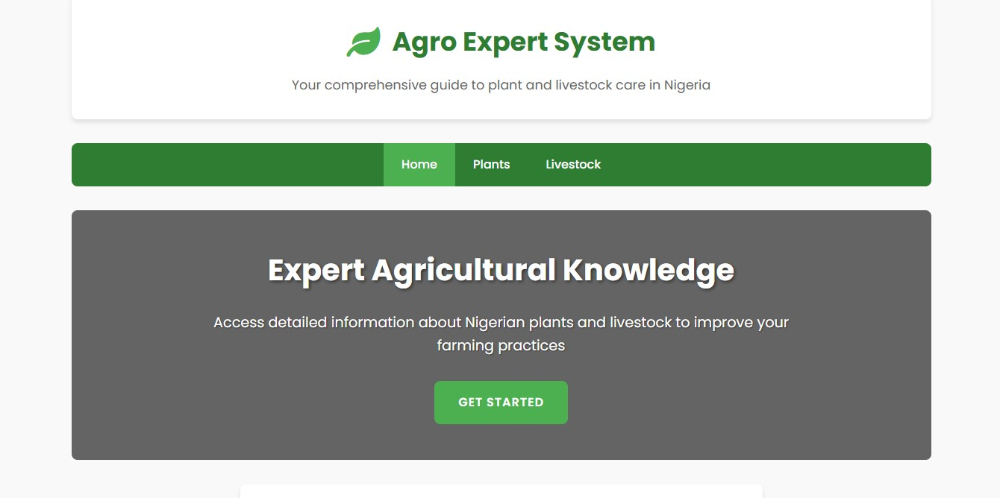

---

## **5. Intelligent System for Farmers README**

```markdown
# 🌾 Intelligent System for Farmers

A full-stack platform designed to provide farmers with insights, tools, and resources to improve agricultural practices and increase crop yields.



---

## 🌟 Overview
This system helps farmers make data-driven decisions by providing:
- Crop health analysis
- Pest management tips
- Weather predictions
- Market trends for better planning

---
(./agro2.jpg)
## ✨ Features
- **Farmer Dashboard** – Central hub for all insights and updates.
- **Pest & Disease Detection** – Helps identify and address issues quickly.
- **Weather Forecast Integration** – For better farm planning.
- **Community Forum** – Farmers can share knowledge and get support.
- **Responsive Mobile-Friendly Design**.

---

## 🛠 Tech Stack
- **Frontend:** React.js, Tailwind CSS  
- **Backend:** Node.js, Express.js  
- **Database:** MySQL  
- **AI Integration:** Python (for data processing)  
- **Deployment:** Vercel

---

## ⚙️ Installation
1. **Clone the repository:**
   ```bash
   git clone https://github.com/priestooo/intelligent-farmer-system.git
